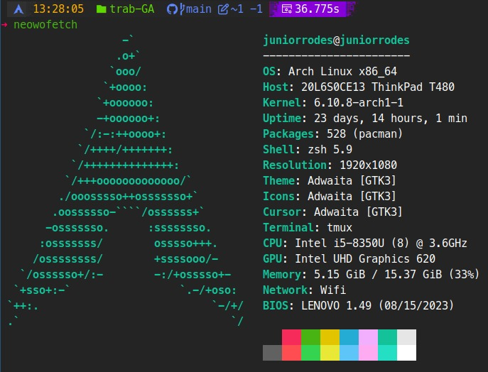

## Compilando
Nós temos duas formas para compilar este programa.

A mais simple e recomendada é rodar o comando `make build` que irá compilar o código e gerar o executável `./kadane.`

Outra forma é rodar o comando `gcc kadane.c -o kadane -O3` diretamente no seu terminal, ele irá gerar o mesmo executavel que está sendo gerado pelo comando make.

## Executando
Para executar o binário `./kadane` basta invocar ele pasando o argumento que é o número do arquivo de teste que será aberto, por exemplo: `./kadane 1` irá abrir o arquivo `./tests/in1`.

## Teste de performance
Para obter um tempo médio de execução pode-se rodar o comando `python metrics.py`, ele irá executar o binário `./kadane` e pegar o output de cada execução e tirar a média, para se ter uma melhor idéia do tempo de execução.

|Arquivo|Tempo de execução|
|-------|-----------------|
|in1    |43.49            |
|in2    |0.007            |
|in3    |0.02             |
|in4    |0.05             |
|in5    |0.005            |
|in6    |0.006            |
|in7    |0.009            |
|in8    |0.007            |

Os testes foram executados no sistema com essas configurações

